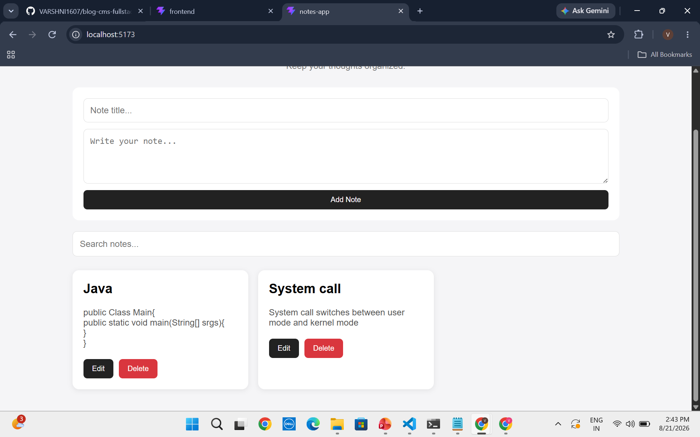
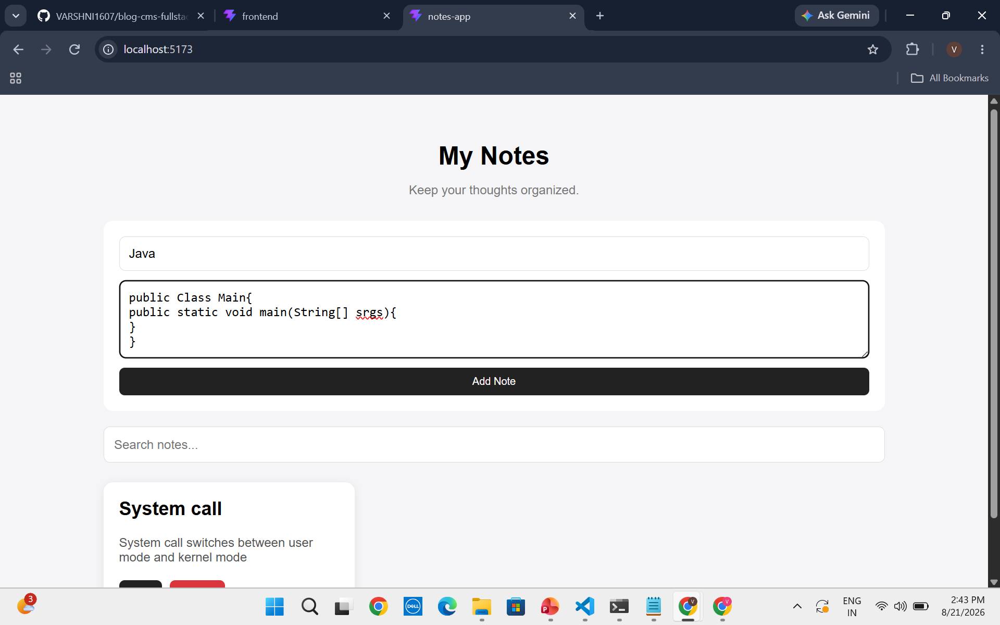
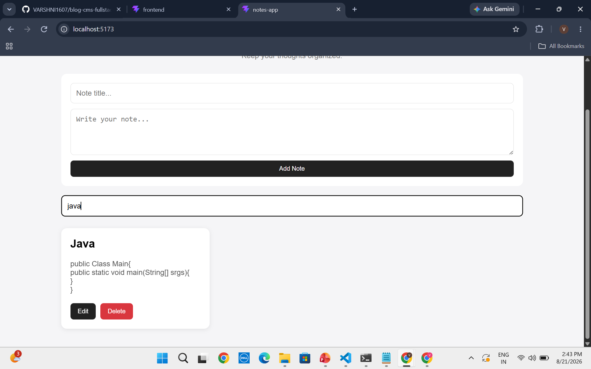

# React Notes App

## 1. Project Title

React Notes Application

## 2. Objective

The objective of this project is to build a simple notes application using React that allows users to create, view, edit, delete, and search notes while storing the data locally in the browser.

## 3. Problem Statement

Users often need a lightweight application to quickly store and organize notes without requiring an account or external database.

This application provides a simple client-side notes management system where notes can be created, modified, searched, and deleted. Notes are stored using browser `localStorage`, allowing them to remain available even after the page is refreshed.

## 4. Tech Stack

* React
* JavaScript
* HTML
* CSS
* Vite
* Browser localStorage

## 5. Implementation Approach

The application was developed using a component-based React architecture.

The main application component manages note data using React state. Separate reusable components are used for creating notes, displaying individual notes, listing notes, and searching notes.

React's `useState` hook is used for managing application state, while `useEffect` is used to synchronize notes with browser `localStorage`.

Search functionality filters notes based on keywords present in the note title or content.

## 6. Features

* Create new notes
* View all notes
* Edit existing notes
* Delete notes
* Search notes by title or content
* Persistent note storage using localStorage
* Responsive card-based interface
* Reusable React components

## 7. Screenshots

### Notes Dashboard



### Create Note



### Search Notes



## 8. How to Run

### Prerequisites

Install Node.js and npm.

### Steps

Clone the repository:

```bash
git clone YOUR_REPOSITORY_URL
```

Open the project folder:

```bash
cd react-notes-app
```

Install dependencies:

```bash
npm install
```

Start the development server:

```bash
npm run dev
```

Open the localhost URL displayed in the terminal, usually:

```text
http://localhost:5173
```

## 9. Future Improvements

* Add categories or tags for notes
* Add pinning and favorites
* Add note creation and modification timestamps
* Add dark mode
* Add sorting options
* Add cloud synchronization and user authentication
* Add backend/database support
